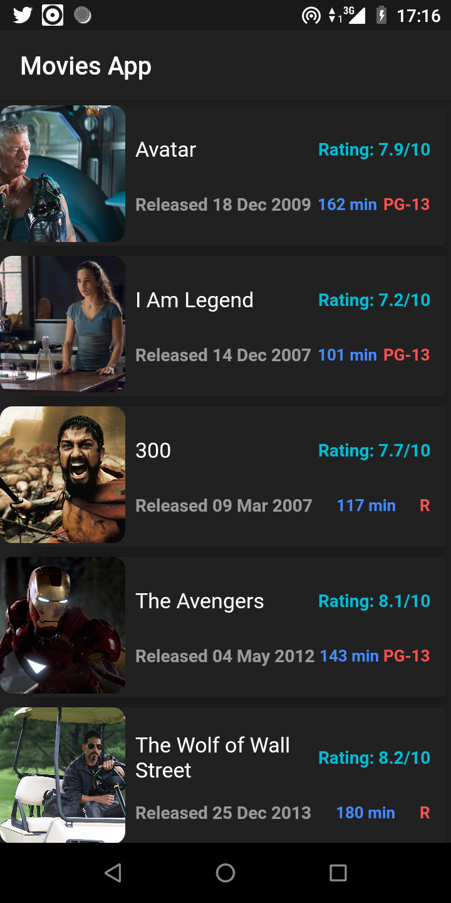
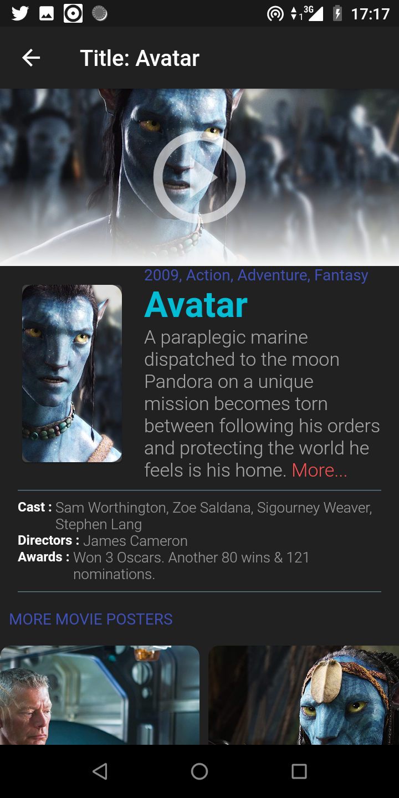

# A set of Flutter Apps

I'm learning how to build flutter apps using the very nice tutorial by [Paulo Dichone](https://github.com/PacktPublishing/The-Complete-Flutter-and-Dart-App-Development-Course-),

## App

